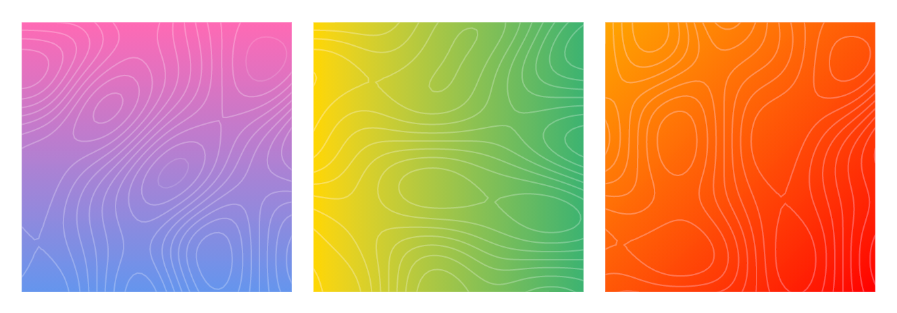
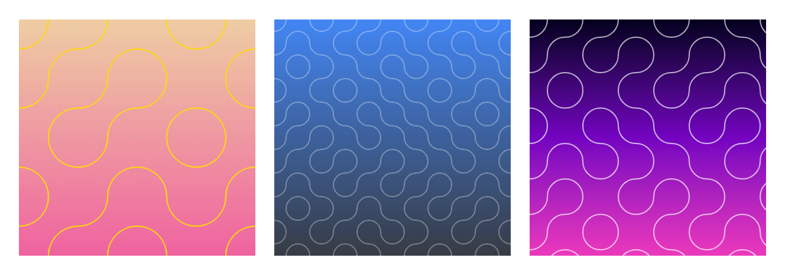
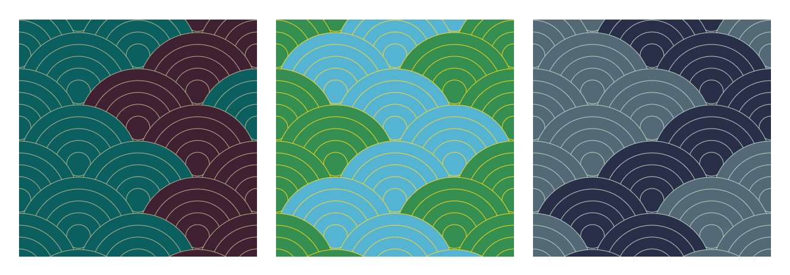

# paintlets

A collection of Houdini paintlets as featured on https://paintlets.londoncss.dev

## Contour



## Truchet


## Seigaiha



---

## Development

1. ```pnpm i```
1. ```pnpm dev```
1. Visit http://localhost:3000/ and click tiles to see variants

Examples are live: changes made to the paintlet source are immediately reflected in the example page via HMR

## TODO

### Paintlets
- [x] Add controls for parameters
- [x] Standardise how to read in props
- [ ] Move example files into packages: src/<paintlet>/index.html
- [ ] Make file names less repetitive

### Infra
- [x] Build process for all paintlets
- [x] Create common vite.config.js that reads in from package.json
- [ ] Limit TS linting to TS files
- [ ] Tests for all paintlets
    - [x] Contour
    - [x] Seigaiha
    - [ ] Truchet

### Publish
- [ ] Make index.html generative?
- [x] Create an examples/index.html listing
- [x] Make /examples the source of /build
- [x] Host at paintlets.londoncss.dev
- [ ] Add DATgui config and make styles configurable & exportable
- [ ] Use component.ai API for gradients
